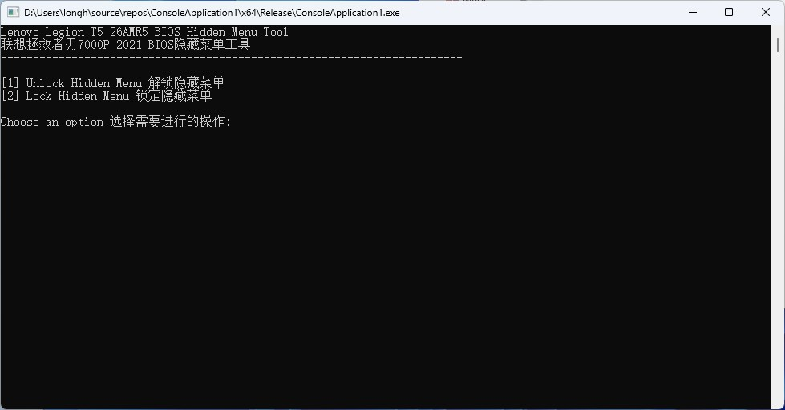

# 拯救者刃7000P 2021（海外T5 26AMR5）解锁BIOS隐藏菜单

- 基于 https://github.com/CalvinXu17/Lenovo-7000k-Unlock-BIOS 修改并做了一些翻译（虽然很草）

## 支持机型
- 拯救者刃7000P 2021（AMD B550芯片组，海外版为Legion T5 26AMR5）

## 能解锁什么
众所周知，品牌机的BIOS基本都非常简陋，选项非常少，可玩性非常低。解锁隐藏菜单后可以调整很多参数，比如超频（手动超频、PBO等）。

## 如何使用
- 在 [Releases](https://github.com/Longhorn3683/Legion-T5-26AMR5-Unlock/releases) 下载文件，以管理员身份运行

## 注意
* 本软件仅修改NVRAM变量不修改任何其他BIOS数据，安全稳定
* 解锁高级功能后在BIOS内所作的修改造成不良后果与此软件无关！**请谨慎操作！**
* BIOS更新会导致解锁失效，需再次运行解锁程序

## 免责声明

- **RUN ON YOUR OWN RISK !!!**

- **该程序仅供学习交流，严禁使用于任何商业用途，若产生利益纠纷，概不负责。**

- **请尊重作者的劳动成果，如需转载，请注明出处，谢谢！**

- **不可将此脚本二次创作后用于商业目的！**
